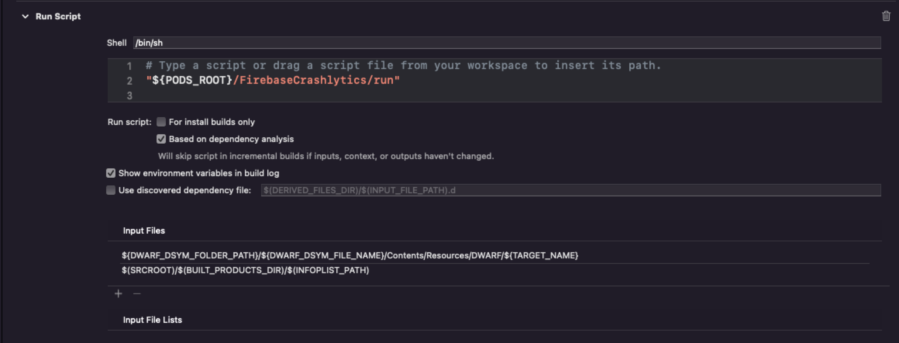

# iOS 接入文档

SDK下载地址(请联系对接人获取)

Xcode环境配置

IDE: Xcode14.0+ 

SDK支持系统: iOS11.0+

SDK支持语言: 阿拉伯语(ar)，英语(en)，土耳其语(tr)，简体中文(zh)，繁体中文(zhtc)

SDK支持架构: arm64

SDK不支持`bitcode`，项目请勿打开(Xcode14.0+已移除 `bitcode`选项)

SDK依赖第三方库(找YllGameSDK方下载): `GTCaptcha4.xcframework` `NetDiag.xcframework`

SDK需要安装Cocoapods管理工具([参考](https://www.kancloud.cn/god-is-coder/cocoapods/617031))

## 1. iOS项目配置

### 1.1. 添加资源

- 将 iOS 目录下的 YllGameSDK.framework 文件夹拷贝到项目中正确目录下
- 右键项目，选择 Add File to "XXX"，选择刚才添加的framework，勾选 "Copy items if needed"，选择 "Create groups"，targets勾选mobile

### 1.2 配置项目

#### 1.2.1 cd 到 xxx.xcodeproj 目录下，pod init 创建pod管理文件

#### 1.2.2 在podfile文件中添加以下依赖库
```obj-c
  pod 'FBSDKLoginKit', '12.3.2'
  pod 'FBSDKShareKit', '12.3.2'
  pod 'AppsFlyerFramework', '6.2.5'
  pod 'Firebase/Analytics', '8.13.0'
  pod 'Firebase/Crashlytics', '8.13.0'
  pod 'Firebase/Messaging', '8.13.0'
  pod 'GoogleSignIn', '6.2.4'
  pod 'AliyunOSSiOS', '2.10.11'
```


- 去掉use_frameworks!前的#
- 在工程的相对应的 `Targets` -> `Build Settings` 的 `Other Linker Flags` ，添加`$(inherited)`
- 然后执行 pod install
- 打开 [工程名].xcworkspace 文件

#### 1.3 配置Game Center、推送和内购配置
- 将`GoogleService-Info.plist`文件拖入项目，并配置以下选项


#### 1.4 Facebook 项目配置，使用包含应用数据的 XML 代码片段配置 Info.plist 文件([官网](https://developers.facebook.com/docs/facebook-login/ios/v2.2?locale=zh_CN))

1.4.1 右键点击 Info.plist，然后选择 Open As(打开方式) ▸ Source Code(源代码)
1.4.2 将下列 XML 代码片段复制并粘贴到文件正文中(<dict>...</dict>)
```xml
<key>CFBundleURLTypes</key>
<array>
    <dict>
        <key>CFBundleTypeRole</key>
        <string>Editor</string>
        <key>CFBundleURLSchemes</key>
        <array>
            <string>fb[APP_ID]</string>
        </array>
    </dict>
</array>

<key>FacebookAdvertiserIDCollectionEnabled</key>
<string>TRUE</string>
<key>FacebookAppID</key>
<string>[APP_ID]</string>
<key>FacebookAutoLogAppEventsEnabled</key>
<string>TRUE</string>
<key>FacebookDisplayName</key>
<string>[APP_NAME]</string>

<key>LSApplicationQueriesSchemes</key>
<array>
    <string>fbapi</string>
    <string>fbapi20130214</string>
    <string>fbapi20130410</string>
    <string>fbapi20130702</string>
    <string>fbapi20131010</string>
    <string>fbapi20131219</string>
    <string>fbapi20140410</string>
    <string>fbapi20140116</string>
    <string>fbapi20150313</string>
    <string>fbapi20150629</string>
    <string>fbapi20160328</string>
    <string>fbauth</string>
    <string>fb-messenger-share-api</string>
    <string>fbauth2</string>
    <string>fbshareextension</string>
</array>
```
1.4.3 在 [CFBundleURLSchemes] 键内的 <array><string> 中，将 [APP_ID] 替换为应用编号
1.4.4 在 FacebookAppID 键内的 <string> 中，将 [APP_ID] 替换为应用编号
1.4.5 在 FacebookDisplayName 键内的 <string> 中，将 [APP_NAME] 替换为应用名称
  
#### 1.5  Google 项目配置，使用包含应用数据的 XML 代码片段配置 Info.plist 文件([官网](https://developers.google.com/identity/sign-in/ios/start))
1.5.1 右键点击 Info.plist，然后选择 Open As(打开方式) ▸ Source Code(源代码)
1.5.2 将下列 XML 代码片段复制并粘贴到文件正文中(<dict>...</dict>)
```xml
<key>CFBundleURLTypes</key>
<array>
    <dict>
        <key>CFBundleTypeRole</key>
        <string>Editor</string>
        <key>CFBundleURLSchemes</key>
        <array>
            <string>[REVERSED_CLIENT_ID]</string>
        </array>
    </dict>
</array>
<key>CLIENT_ID</key>
<string>[CLIENT_ID]</string>
<key>REVERSED_CLIENT_ID</key>
<string>[REVERSED_CLIENT_ID]</string>
```
1.5.3 在 [CFBundleURLSchemes] 键内的 <array><string> 中，将 [REVERSED_CLIENT_ID] 替换为反向的客户ID
1.5.4 在 CLIENT_ID 键内的 <string> 中，将 [CLIENT_ID] 替换为客户端ID
1.5.5 在 REVERSED_CLIENT_ID 键内的 <string> 中，将 [REVERSED_CLIENT_ID] 替换为反向的客户ID
  
#### 1.6 Firebase Crashlytics 接入([官网](https://firebase.google.com/docs/crashlytics?hl=zh-cn))
1.6.1 确定 Podfile 已添加 pod 'Firebase/Crashlytics', '8.13.0', 且已经执行 pod install<br>
1.6.2 在工程的相对应的 `Targets` -> `Build Settings` 搜索 `debug information format` ，将 Debug 和 Release 都设为 `DWARF with dSYM File`<br>
1.6.3 在工程的相对应的 `Targets` -> `Build Phases`, 添加 `New Run Script Phase` ，添加 `"${PODS_ROOT}/FirebaseCrashlytics/run"`，在当前的 Run Script 的Input Files下，添加 `${DWARF_DSYM_FOLDER_PATH}/${DWARF_DSYM_FILE_NAME}/Contents/Resources/DWARF/${TARGET_NAME}` `$(SRCROOT)/$(BUILT_PRODUCTS_DIR)/$(INFOPLIST_PATH)`<br>


#### 1.7 SDK所需权限
- Privacy - Photo Library Usage Description 相册权限 
- Privacy - Tracking Usage Description IDFA权限 
- Privacy - Location Always and When In Use Usage Description 地理位置权限
- Privacy - Location Always Usage Description 地理位置权限
- Privacy - Location Usage Description 地理位置权限
- Privacy - Location When In Use Usage Description 地理位置权限
- 权限的具体描述请根据游戏的实际使用进行定义，如果游戏没有使用，可以向SDK方要通用的描述

`注: iOS14.0+ 因为有部分相册功能, 需要添加 PhotosUI.framework`  

## 2. SDK初始化

### 2.1 SDK初始化

- 在`AppDelegate.m`中添加头文件引用

```obj-c
#import <YllGameSDK/YllGameSDK.h>
```

- 在`AppDelegate.m`的`didFinishLaunchingWithOptions`函数中添加以下代码
```obj-c
- (BOOL)application:(UIApplication *)application didFinishLaunchingWithOptions:(NSDictionary *)launchOptions {
    
    // YllSDK-------Begin------gameAppId, appleAppId, appsFlyerDevKey这些参数需要联系游戏发行方获取，改为自己的！
    [YllGameSDK getInstance].gameAppId = @"";
    [YllGameSDK getInstance].appleAppId = @"";
    [YllGameSDK getInstance].appsFlyerDevKey = @"";
    
    /** languageList SDK支持语言集合, 该集合默认第一个值将是SDK的默认语言, 若为null SDK只支持默认的 en
      ar     阿语
      en     英语
      tr     土语
      zh     中文简体
      zhtc   中文繁体
    */
    [YllGameSDK getInstance].languageList = @[@"en", @"ar", @"tr", @"zh", @"zhtc"];
    // 当前设置的语言, 不传以 languageList 的第一个值为默认语言, 若 languageList 为 null, 默认为 en
    [YllGameSDK getInstance].localLanguage = @"en";
    // 设置游戏隐私协议地址(发行提供)
    [YllGameSDK getInstance].privacyPolicy = @"";
    // 设置游戏服务协议地址(发行提供)
    [YllGameSDK getInstance].termsService = @"";
    // 实现推送代理
    [YllGameSDK getInstance].notificationDelegate = self;
    // 设置完以上属性之后再调用该方法, 不然对于语区统计会有影响
    [[YllGameSDK getInstance] yg_application:application didFinishLaunchingWithOptions:launchOptions];
    // 初始化SDK
    [[YllGameSDK getInstance] yg_init];
    return YES;
}
```

- 在`AppDelegate.m`中添加以下函数
```obj-c
- (BOOL)application:(UIApplication *)application openURL:(NSURL *)url options:(nonnull NSDictionary<UIApplicationOpenURLOptionsKey, id> *)options {
    return [[YllGameSDK getInstance] yg_application:application openURL:url options:options];
}

- (BOOL)application:(UIApplication *)application continueUserActivity:(NSUserActivity *)userActivity restorationHandler:(void (^)(NSArray<id<UIUserActivityRestoring>> * _Nullable))restorationHandler {
    return [[YllGameSDK getInstance] yg_application:application continueUserActivity:userActivity restorationHandler:restorationHandler];
}

- (void)application:(UIApplication *)application didRegisterForRemoteNotificationsWithDeviceToken:(NSData *)deviceToken {
    [[YllGameSDK getInstance] yg_application:application didRegisterForRemoteNotificationsWithDeviceToken:deviceToken];
}

- (void)applicationDidBecomeActive:(UIApplication *)application {
    [[YllGameSDK getInstance] yg_applicationDidBecomeActive:application];
}

- (void)applicationDidEnterBackground:(UIApplication *)application {
    [[YllGameSDK getInstance] yg_applicationDidEnterBackground:application];
}

- (void)applicationWillTerminate:(UIApplication *)application {
    [[YllGameSDK getInstance] yg_applicationWillTerminate:application];
}
  
```
### 2.2 配置 GameAppId
- SDK方提供
  
```obj-c
[YllGameSDK getInstance].gameAppId = @"";
```
  
### 2.3 配置 appleAppId
- SDK方提供
  
```obj-c
[YllGameSDK getInstance].appleAppId = @"";
```
  
### 2.5 配置 appsFlyerDevKey
- SDK方提供
  
```obj-c
[YllGameSDK getInstance].appsFlyerDevKey = @"";
```
  
### 2.6 配置SDK语言
```obj-c
/** languageList SDK支持语言集合, 该集合默认第一个值将是SDK的默认语言, 若为null SDK只支持默认的 en
    ar     阿语
    en     英语
    tr     土语
    zh     中文简体
    zhtc   中文繁体
 */
[YllGameSDK getInstance].languageList = @[@"en", @"ar", @"tr", @"zh", @"zhtc"];
// 当前设置的语言, 不传以 languageList 的第一个值为默认语言, 若 languageList 为 null, 默认为 en
[YllGameSDK getInstance].localLanguage = @"en";
```
  
### 2.7 配置SDK网络模式
- 提供了 YGStrongNet 和 YGWeakNet 两种网络模式, SDK 默认为 YGStrongNet
- 当设置为 YGWeakNet 模式, 在 SDK 登录且同步角色未成功 或 无网络情况下, SDK 除登录页面以外的功能将受到限制使用

```obj-c
[YllGameSDK getInstance].netMode = YGStrongNet;
```
  
### 2.8 配置游戏隐私协议地址(发行提供)
```obj-c
[YllGameSDK getInstance].privacyPolicy = @"";
```
  
### 2.9 配置游戏服务协议地址(发行提供)
```obj-c
[YllGameSDK getInstance].termsService = @"";
```
  
## 3. SDK API接口
### 3.1 登陆与回调
  
- SDK为游戏方提供了两种登录获取账号信息方式，即代理和闭包，本文档的登录是用闭包，如需使用代理，请自行跳转到YllGameSDK.h文件进行查阅 
- 在项目中需要进行登录操作的xxx.h或xxx.m文件中导入 #import <YllGameSDK/YllGameSDK.h>

```obj-c
#import <YllGameSDK/YllGameSDK.h>
```

- 在`ViewController.m`文件中，实现对应的函数
```
[[YllGameSDK getInstance] yg_loginWithUserInfo:^(YGUserInfoModel * userInfoModel) {
    /** 
    请根据返回 userInfoModel 内 state 的不同枚举值进行实际业务场景处理
    当 userInfoModel.state == YGLoginSuccess || userInfoModel.state == YGChangeNickName 时, userInfoModel 里面的其他属性才有值
    弱网模式下的切换账号的成功或失败发送的 state 也是 YGLoginSuccess 和 YGLoginFailure
    typedef NS_ENUM(NSInteger, YGState) {
        YGTokenOverdue,   // token过期
        YGChangeNickName, // 修改昵称成功
        YGLoginSuccess,   // 登录成功
        YGLoginFailure,   // 登录失败
        YGAccountBlock,   // 账号被封
        YGAccountRemote,  // 异地登录
        YGLogout,         // 退出登录
        YGAccountExpired, // 账号登录时效过期
        YGAccountCancel,  // 账号注销
    };
    */
 }];
```
- 修改昵称成功(YGChangeNickName)是SDK账户体系的昵称修改，如果不使用，可以忽略
- 除登录成功(YGLoginSuccess)和昵称成功(YGChangeNickName)，接收到其它状态游戏方都需要退出到登陆界面并且清除本地用户信息，再调用SDK登录函数
  
### 3.2 游客静默登陆与回调
  
- SDK为游戏方提供了两种游客静默登录获取账号信息方式，即代理和闭包，本文档的登录是用闭包，如需使用代理，请自行跳转到YllGameSDK.h文件进行查阅 
- 在项目中需要进行登录操作的xxx.h或xxx.m文件中导入 #import <YllGameSDK/YllGameSDK.h>
  
```obj-c
#import <YllGameSDK/YllGameSDK.h>
```

- 在`ViewController.m`文件中，实现对应的函数
```
[[YllGameSDK getInstance] yg_silentGuestLoginWithUserInfo:^(YGUserInfoModel * userInfoModel) {
    /** 
    请根据返回 userInfoModel 内 state 的不同枚举值进行实际业务场景处理
    当 userInfoModel.state == YGLoginSuccess || userInfoModel.state == YGChangeNickName 时, userInfoModel 里面的其他属性才有值
    弱网模式下的切换账号的成功或失败发送的 state 也是 YGLoginSuccess 和 YGLoginFailure
    typedef NS_ENUM(NSInteger, YGState) {
        YGTokenOverdue,   // token过期
        YGChangeNickName, // 修改昵称成功
        YGLoginSuccess,   // 登录成功
        YGLoginFailure,   // 登录失败
        YGAccountBlock,   // 账号被封
        YGAccountRemote,  // 异地登录
        YGLogout,         // 退出登录
        YGAccountExpired, // 账号登录时效过期
        YGAccountCancel,  // 账号注销
    };
    */
 }];
```
- 修改昵称成功(YGChangeNickName)是SDK账户体系的昵称修改，如果不使用，可以忽略
- 除登录成功(YGLoginSuccess)和昵称成功(YGChangeNickName)，接收到其它状态游戏方都需要退出到登陆界面并且清除本地用户信息，再调用SDK登录函数

### 3.3 同步角色与回调
- 在获取SDK用户信息之后，需要调用此函数，否则会影响内购的补单操作
- 在游戏使用中，此函数中的任意参数发生变化，都需要调用此函数，进行数据同步
```obj-c
/// 同步游戏角色(游戏登录之后必须调用)
/// @param roleId 游戏角色
/// @param roleName 角色名
/// @param roleLevel 角色等级
/// @param roleVipLevel 角色vip等级
/// @param gameServerId 所在游戏服
/// @param roleCastleLevel 城堡等级
/// @param completeHandle  error == nil  成功 
[[YllGameSDK getInstance] yg_synchroRoleWithRoleId:<#(nonnull NSString *)#> roleName:<#(nonnull NSString *)#> roleLevel:<#(nonnull NSString *)#> roleVipLevel:<#(nonnull NSString *)#> gameServerId:<#(nonnull NSString *)#> roleCastleLevel:<#(nonnull NSString *)#> completeHandle:^(NSError * _Nullable) {
     if (!error) {
     
     }
}];
```

### 3.4 内购充值与回调
  
- 使用SDK充值功能，需要先登录获取SDK的用户信息(文档3.2或3.3)且同步角色(文档3.4)成功之后
- SDK对内购支付中出现的任何报错进行了弹窗提示，游戏方也可以从返回的失败回调内拿到具体的错误信息

```obj-c
/// 创建消耗型内购支付订单
/// @param roleId 游戏角色Id
/// @param gameServerId 角色所在区服Id
/// @param cpno 订单号
/// @param cptime 订单生成时间
/// @param sku sku
/// @param amount amount
/// @param pointId 消费点Id
/// @param orderType 订单类型（0：普通订单 1：补款订单）
[[YllGameSDK getInstance] yg_createOrderWithRoleId:<#(nonnull NSString *)#> gameServerId:<#(nonnull NSString *)#> cpno:<#(nonnull NSString *)#> cptime:<#(nonnull NSString *)#> sku:<#(nonnull NSString *)#> amount:<#(nonnull NSString *)#> pointId:<#(nonnull NSString *)#> orderType:<#(nonnull NSString *)#> successBlock:^{
        <#code#>
    } failedBlock:^(YGPaymentFailedType type, NSString * _Nonnull errorDescription) {
        <#code#>
}];
```
### 3.5 订阅充值与回调
  
- 使用SDK订阅功能，需要先登录获取SDK的用户信息(文档3.2或3.3)且同步角色(文档3.4)成功之后
- SDK对内购支付中出现的任何报错进行了弹窗提示，游戏方也可以从返回的失败回调内拿到具体的错误信息

```obj-c
/// 创建自动连续订阅型订单
/// @param roleId 游戏角色Id
/// @param gameServerId 角色所在区服Id
/// @param cpno 订单号
/// @param cptime 订单生成时间
/// @param sku sku
/// @param amount amount
/// @param pointId 消费点Id
[[YllGameSDK getInstance] yg_createSubscribeOrderWithRoleId:<#(nonnull NSString *)#> gameServerId:<#(nonnull NSString *)#> cpno:<#(nonnull NSString *)#> cptime:<#(nonnull NSString *)#> sku:<#(nonnull NSString *)#> amount:<#(nonnull NSString *)#> pointId:<#(nonnull NSString *)#> successBlock:^{
        <#code#>
    } failedBlock:^(YGPaymentFailedType type, NSString * _Nonnull errorDescription) {
        <#code#>
}];
```

### 3.6 打开SDK设置界面
      
- 使用SDK设置界面，需要先登录获取SDK的用户信息(文档3.2或3.3)且同步角色(文档3.4)成功之后

```obj-c
/// 展示设置中心
/// @param roleId 游戏角色Id
/// @param gameServerId 角色所在区服Id
[[YllGameSDK getInstance] yg_showSettingsViewWithRoleId:<#(nonnull NSString *)#> gameServerId:<#(nonnull NSString *)#>];
```

### 3.7 打开修改昵称界面
          
- 使用SDK修改昵称界面，需要先登录获取SDK的用户信息(文档3.2或3.3)且同步角色(文档3.4)成功之后

```obj-c
/// 展示昵称修改页面
[[YllGameSDK getInstance] yg_showNicknameView];
```

### 3.8 打开用户管理界面
          
- 使用SDK用户管理界面，需要先登录获取SDK的用户信息(文档3.2或3.3)且同步角色(文档3.4)成功之后

```obj-c
/// 展示账户管理
[[YllGameSDK getInstance] yg_showAccountManagementView];
```

### 3.9 检查账号绑定

```obj-c
/// 检查游客账号是否绑定第三方账号, true == 绑定, false == 未绑定
- (BOOL)yg_checkBindState;
```

### 3.10 自定义埋点
          
- SDK提供埋点功能, 分别上报到YallaGame, Firebase、Facebook和Appflyer 数据平台
```obj-c
// 上报到YallaGame
[[YGEventManager getInstance] onEvent:<#(nonnull NSString *)#>];
// 上报到YallaGame
[[YGEventManager getInstance] onEvent:<#(nonnull NSString *)#> params:<#(NSDictionary * _Nullable)#>];
// 上报到Firebase
[[YGEventManager getInstance] onFirebaseEvent:<#(nonnull NSString *)#> params:<#(NSDictionary * _Nullable)#>];
// 上报到Facebook
[[YGEventManager getInstance] onFacebookEvent:<#(nonnull NSString *)#> params:<#(NSDictionary * _Nullable)#>];
// 上报到Appflyer
[[YGEventManager getInstance] onAppsFlyerEvent:<#(nonnull NSString *)#> params:<#(NSDictionary * _Nullable)#>];
// 上报到Firebase&Facebook&Appflyer事件方法
[[YGEventManager getInstance] onThirdEvent:<#(nonnull NSString *)#> params:<#(NSDictionary * _Nullable)#>];
```

eventName和params参照([YllSDK iOS埋点](https://github.com/yllgame2021/yllgame_sdk/tree/main/%E5%9F%8B%E7%82%B9%E9%9C%80%E6%B1%82/iOS))

### 3.11 获取推送token

```obj-c
[[YllGameSDK getInstance] yg_getPushToken:<#^(NSString * _Nullable, NSError * _Nullable)pushToken#>];
```

### 3.12 推送处理

- 推送分为SDK推送和游戏方推送，区分两者的方法在于主要在于返回的消息字典(userInfo)内是否含有 YllGameSDKMsgId 这个key，包含该key表明是SDK推送，游戏方可不用处理该条推送.

1. App冷启动，在此方法处理推送
```obj-c
- (BOOL)application:(UIApplication *)application didFinishLaunchingWithOptions:(NSDictionary *)launchOptions {
    if (launchOptions && [launchOptions.allKeys containsObject:UIApplicationLaunchOptionsRemoteNotificationKey]) {
         NSDictionary *userInfo = launchOptions[UIApplicationLaunchOptionsRemoteNotificationKey];
    }
}
```
2. App在前台或后台，收到通知在此方法处理推送
```obj-c
- (void)application:(UIApplication *)application didReceiveRemoteNotification:(NSDictionary *)userInfo fetchCompletionHandler:(void (^)(UIBackgroundFetchResult))completionHandler { }
```

### 3.13 获取SDK版本

```obj-c
// 调用该方法, 在控制台显示当前SDK的版本信息
NSString *SDKVersion = [[YllGameSDK getInstance] yg_getSDKVersion];
```

### 3.14 获取SDKBuild

```obj-c
// 调用该方法, 在控制台显示当前SDK的版本信息
NSString *SDKBuild = [[YllGameSDK getInstance] yg_getSDKBuild];
```

### 3.15 检查SDK版本(非必要)
- 此方法只是在控制台打印当前SDK的版本和最新的SDK版本

```obj-c
// 调用该方法, 在控制台显示当前SDK的版本信息
[[YllGameSDK getInstance] yg_checkSDKVersion];
```
          
### 3.16 Facebook 分享
- 提供了 链接 和 图片 两种分享, 并返回了 成功/取消/失败 相对应的回调

```obj-c
/// 链接分享
[[YGShareManager getInstance] shareLinkContentWithQuote:<#(nullable NSString *)#> linkContent:<#(nonnull NSString *)#> success:^{
    <#code#>
} cancel:^{
    <#code#>
} failed:^(NSError * _Nonnull) {
    <#code#>
}];
```
```obj-c
/// 图片分享
[[YGShareManager getInstance] sharePhotoWithPhotoArray:<#(nonnull NSArray<FBSDKSharePhoto *> *)#> success:^{
    <#code#>
} cancel:^{
    <#code#>
} failed:^(NSError * _Nonnull) {
    <#code#>
}];
```
      
 ### 3.17 获取 Facebook 好友列表
- 提供了返回共同登录该应用的 facebook 好友列表接口

```obj-c
[[YllGameSDK getInstance] yg_getFacebookFriendsWithCompleteHandler:<#^(NSArray<YGFBFriendInfoModel *> * _Nonnull)completeHandler#>];
```

 ### 3.18 打开举报页面
- 提供举报用户页面
      
```obj-c
/// 展示举报页面
/// @param roportRoleId 举报者角色Id
/// @param reportedRoleId 被举报者角色Id
/// @param gameServerId 被举报者角色坐在游戏区服Id
[[YllGameSDK getInstance] yg_showReportViewWithRoportRoleId:<#(nonnull NSString *)#> reportedRoleId:<#(nonnull NSString *)#> gameServerId:<#(nonnull NSString *)#>];
```

 ###  3.19 补单成功回调
- 提供补单成功回调, 返回游戏方订单id
```obj-c
[[YllGameSDK getInstance] yg_orderReplenishmentSuccessHandler:<#^(NSString * _Nonnull)successHandler#>];
```
        
### 3.20 打开展示房间/房间用户举报页面
- 提供展示房间/房间用户举报功能
      
```obj-c
/// 展示房间/房间用户举报页面
/// @param reportTarget 举报对象 1房间 2角色
/// @param fromGameServerId 举报者区服Id
/// @param fromRoleId 举报者角色Id
/// @param toGameServerId 被举举报者区服Id
/// @param toRoleId 被举报者角色Id
/// @param toRoomId 被举报者房间Id
[[YllGameSDK getInstance] yg_showRoomReportViewWithReportTarget:<#(nonnull NSString *)#> fromGameServerId:<#(nonnull NSString *)#> fromRoleId:<#(nonnull NSString *)#> toGameServerId:<#(nonnull NSString *)#> toRoleId:<#(nonnull NSString *)#> toRoomId:<#(nonnull NSString *)#>];
```

### 3.21 上传图片
- 提供打开相册并上传图片, 返回图片地址
      
```obj-c
/// 上传图片
/// @param selectedType 选择相册之后的显示模式
[[YllGameSDK getInstance] yg_updatePictureWithAlbumSelectedType:<#(YGAlbumSelectedType)#> successBlock:<#^(NSString * _Nullable imageUrl)successBlock#> failedBlock:<#^(NSString * _Nullable error)failedBlock#>];
```

### 3.22 获取活动信息
- 提供获取活动信息接口, 返回活动信息数组
      
```obj-c
/// 获取活动接口
/// @param roleId 游戏角色Id
/// @param gameServerId 角色所在区服Id
[[YllGameSDK getInstance] yg_getActivityInfosWithRoleId:<#(nonnull NSString *)#> gameServerId:<#(nonnull NSString *)#> completeHandler:<#^(NSArray<YGActivityModel *> * _Nullable)completeHandler#>];
```

### 3.23 获取手机号绑定状态
- 提供获取手机号绑定状态, 返回绑定结果
      
```obj-c
/// 获取手机号绑定状态
/// @param completeHandler true = 绑定, false = 为绑定
[[YllGameSDK getInstance] yg_getPhoneBindStateWithCompleteHandler:<#^(BOOL)completeHandler#>];
```
        
### 3.24 跳转到facebook主页
- 提供跳转到指定用户的facebook主页功能
      
```obj-c
/// 跳转到facebook主页
/// @param pageId 目标主页的id
/// @param completeHandler 跳转结果 true = 成功, false = 失败
[[YllGameSDK getInstance] yg_openFacebookPageWithPageId:<#(nonnull NSString *)#> completeHandler:<#^(BOOL)completeHandler#>];
```
      
### 3.25 展示账号绑定页面
- 显示账号绑定页面, 并返回当前账号所有的绑定信息模型

```obj-c
/// 展示账号绑定页面
[[YllGameSDK getInstance] yg_showAccountBindViewWithCompleteHandler:<#^(YGUserAcccountBindModel * _Nonnull)completeHandler#>];
```
      
### 3.26 展示手机号绑定页面
- 显示手机号绑定页面, 返回是否绑定成功的结果
      
```obj-c
/// 展示账号绑定页面
[[YllGameSDK getInstance] yg_showPhoneBindViewWithCompleteHandler:<#^(BOOL)completeHandler#>];
```
      
### 3.27 展示举报消息页面
- 展示普通消息举报页面
      
```obj-c
/// 展示举报消息页面
/// @param serverId 举报游戏服Id
/// @param reportRoleId 举报者角色Id
/// @param beReportRoleId 被举报者角色Id
/// @param scene 举报场景
/// @param chatMsgList 举报信息数组
[[YllGameSDK getInstance] yg_showReportCustomMsgViewWithServerId:<#(nonnull NSString *)#> reportRoleId:<#(nonnull NSString *)#> beReportRoleId:<#(nonnull NSString *)#> scene:<#(nonnull NSString *)#> chatMsgList:<#(nonnull NSArray<YGReprotModel *> *)#>];
```
      
### 3.28 展示举报语聊房消息页面
- 展示房间聊天消息举报页面
      
```obj-c
/// 展示举报语聊房消息页面
/// @param roomId 房间Id
/// @param reportGameServerId 举报者区服Id
/// @param beReportGameServerId 被举报者区服Id
/// @param reportRoleId 举报者角色Id
/// @param beReportRoleId 被举报者角色Id
/// @param chatMsgList 举报信息数组
[[YllGameSDK getInstance] yg_showReportChatRoomMsgViewWithRoomId:<#(nonnull NSString *)#> reportGameServerId:<#(nonnull NSString *)#> beReportGameServerId:<#(nonnull NSString *)#> reportRoleId:<#(nonnull NSString *)#> beReportRoleId:<#(nonnull NSString *)#> chatMsgList:<#(nonnull NSArray<YGReprotModel *> *)#>];
```
      
### 3.29 展示网络检测页面
- 网络检测功能页面, 提供一键复制检测结果功能
- 该方法需要依赖 NetDiag.xcframework, 该 framework 需要找SDK方下载

```obj-c
/// 展示网络检测页面
/// @param userId 用户Id
/// @param roleId 游戏角色Id
[[YllGameSDK getInstance] yg_showNetCheckViewWithUserId:<#(NSString * _Nullable)#> roleId:<#(NSString * _Nullable)#>];
```

### 3.30 获取用户消息数量变更通知

```obj-c
/// 获取用户消息数量变更通知
/// @param roleId 游戏角色Id
/// @param gameServerId 角色所在区服Id
[[YllGameSDK getInstance] yg_getCustomerMsgWithRoleId:<#(nonnull NSString *)#> gameServerId:<#(nonnull NSString *)#> completeHandler:<#^(int msgNum)completeHandler#>];
```
      
### 3.31 展示客服页面
- 调用该函数前需先调用 `3.30 获取用户消息数量变更通知`
```obj-c
/// 展示客服页面
[[YllGameSDK getInstance] yg_showCustomerView];
```

### 3.32 推送功能
- 推送功能, 业务不需要可不接入该功能
1. 在 `AppDelegate.m` 文件的 `- (BOOL)application:(UIApplication *)application didFinishLaunchingWithOptions:(NSDictionary *)launchOptions` 函数内添加新增代码
```obj-c
[YllGameSDK getInstance].notificationDelegate = self;
```
      
2. `AppDelegate.m` 遵守协议
```obj-c
@interface AppDelegate ()<YGUNUserNotificationCenterDelegate>

@end
```

3. 实现以下代理函数
```obj-c
/// 前台推送才会收到, 可以设置通知是否需要展示
- (void)yg_userNotificationCenter:(UNUserNotificationCenter *)center willPresentNotification:(UNNotification *)notification withCompletionHandler:(void (^)(UNNotificationPresentationOptions options))completionHandler API_AVAILABLE(ios(10.0));

/// 当用户与推送的通知进行交互时被调用，包括用户通过通知打开了应用或者触发了某个action
- (void)yg_userNotificationCenter:(UNUserNotificationCenter *)center didReceiveNotificationResponse:(UNNotificationResponse *)response withCompletionHandler:(void(^)(void))completionHandler API_AVAILABLE(ios(10.0));
```
  
### 3.33 获取初始化语区
- 该函数为游戏在第一次安装启动或注册新账户时, 根据用户的手机设置的国家和语言获取一个对应的语区语言
```obj-c
YGLanguage language = [[YllGameSDK getInstance] yg_getSDKLanguage];
```

### 3.34 删除游戏角色
```obj-c
/// 删除游戏角色
/// @param roleId 游戏角色id
/// @param serverId 角色所在游戏区服id
/// @param completeHandler BOOL true: 成功 false: 失败
[[YllGameSDK getInstance] yg_deleteRoleWithRoleId:<#(NSString * _Nonnull)#> serverId:<#(NSString * _Nonnull)#> completeHandler:<#^(BOOL)completeHandler#>];
```     
      
### 3.35 获取商品本地化信息
```obj-c
/// 获取商品本地化信息
/// @param productIds 商品Id数组
/// @param completeHandler BOOL true: 成功 false: 失败
[[YllGameSDK getInstance] yg_getProductLocaleInfoWithProductIds:<#(nonnull NSArray<NSString *> *)#> completionHandler:<#^(NSArray<YGProductInfoModel *> * _Nonnull)completionHandler#>];
```  
    
